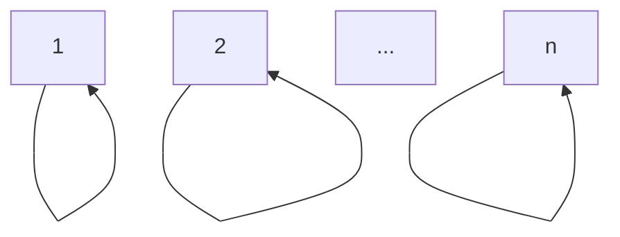
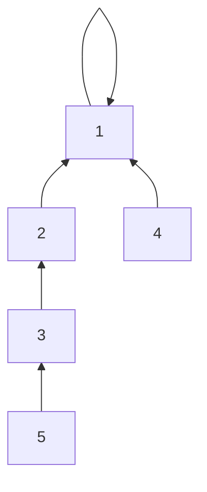
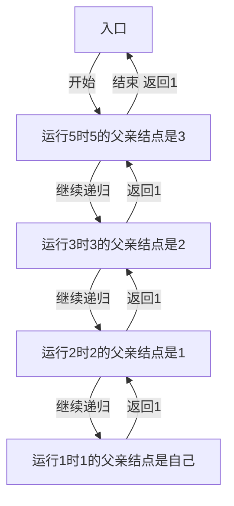
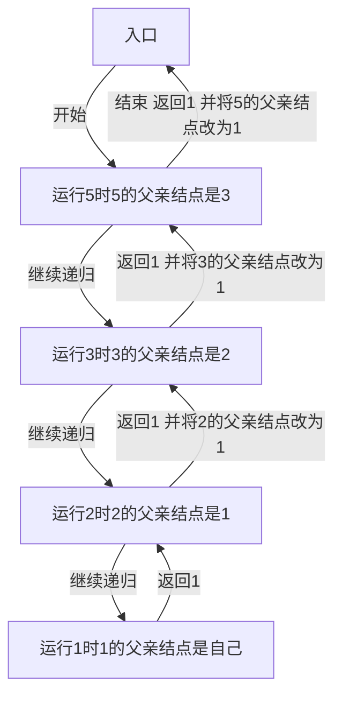
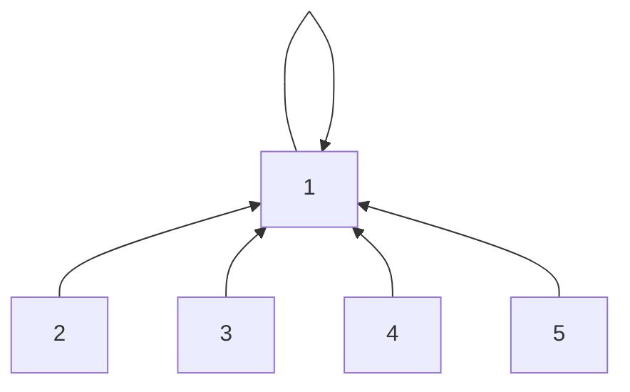
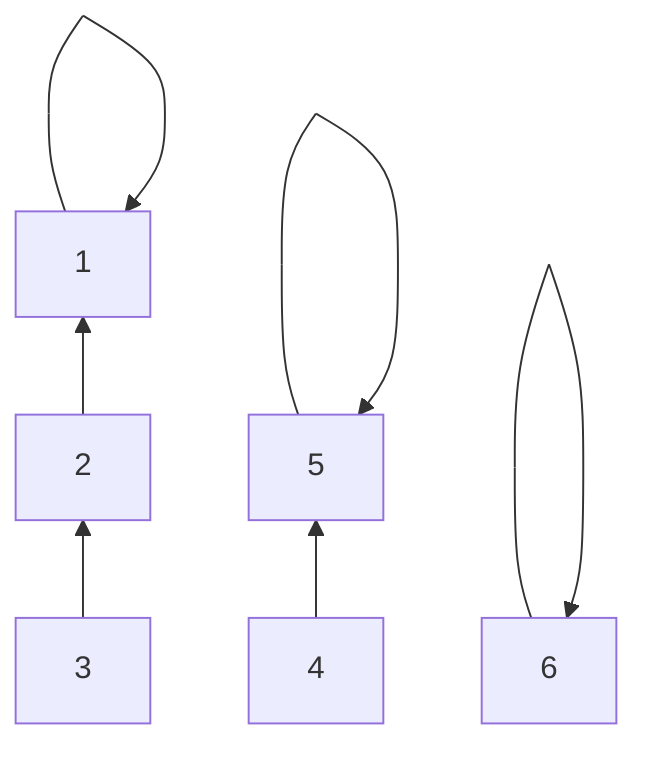
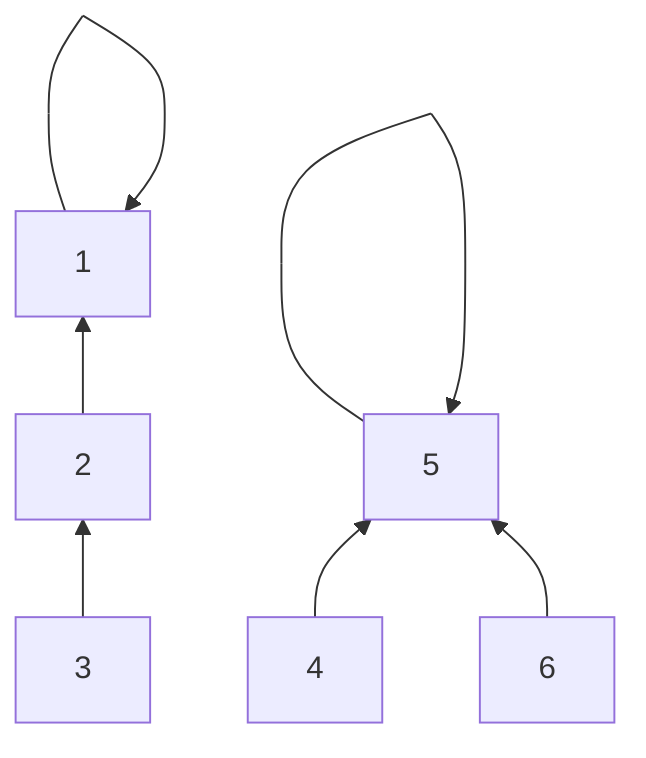
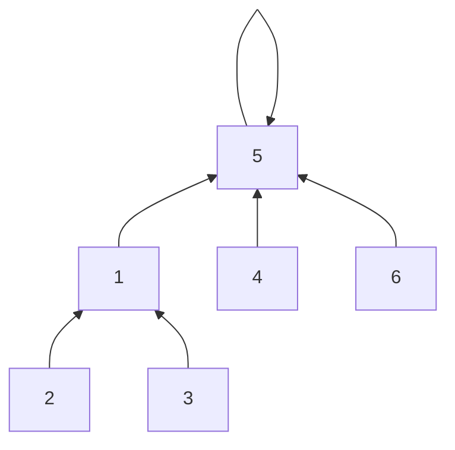

## 介绍

并查集是一种数据结构，体现的是森林（或者树）形态，主要操作有两种：

- 并，意为合并，操作函数为`void connect(int,int);`（注：`connect vt. & vi. 连接`）；
- 查，意为查询：
	- 查询一个节点的父亲节点，查询函数为`int find(int);`（注：`find v. 寻找`）；
	- 查询两个节点是否在用一个集合内，查询函数为`bool search(int,int);`（注：`search v. 搜寻`）。

<!-- more -->

## 具体思路与实现

首先，因为并查集是森林（或者树）的一种，所以我们可以用树的三种表示方法其中之一——父亲结点表示法（其它两种方法是`儿子结点表示法`和`儿子、兄弟表示法`）。

定义数组`ID[n]`（一般编程时数组下标从$1$开始，应使用`ID[n+1]`），`ID[i]`表示第$i$个结点当前状态下的父亲。

假设有$n$个结点，为了方便，我们将每一个结点初始的父亲设为它自己。

代码实现如下：

```cpp
#define n 100000//假设n=10^5

int ID[n+1];

void Init(void){//初始化函数
	register int i;
	for(i=1;i<=n;++i)
		ID[i]=i;
	return;
}
```

初始化后的示意图如下：



下面重点介绍如何查询一个节点的父亲节点。

### `int find(int);`

#### 不带路径压缩

用`find(x)`表示`x`的父亲结点的编号。

代码实现如下：

```cpp
int find(int x){
	if(x==ID[x])//如果x的父亲结点是自己
		return x;//返回x，停止递归
	else
		return find(ID[x]);//继续递归查找父亲结点
}
```

用图理解如下：

设$n=5$，此时并查集的状态如下：



运行`find(5)`，过程如下：



如果还不能理解的话，请手动模拟。

#### 路径压缩

用`find(x)`表示`x`的父亲结点的编号。

代码实现如下：

```cpp
int find(int x){
	if(x==ID[x])//如果x的父亲结点是自己
		return x;//返回x，停止递归
	else
		return ID[x]=find(ID[x]);//继续递归查找父亲结点，并赋值以压缩路径
}
```

用图理解如下：

设$n=5$，此时并查集的状态如下：


运行`find(5)`，过程如下：



运行过后，整个并查集的状态发生了改变，变成了这样：




在这次操作之后，再次调用`find(5)`只需要$O(1)$的时间。

### `void connect(int,int);`

在此之前，我们已经实现了`int find(int);`，那么其他的两个操作都比较简单，具体实现如下：

```cpp
void connect(int a,int b){
	register int ra=find(a),rb=find(b);//寻找a和b的祖先节点，记为ra,rb
	if(ra!=rb)//假如a,b的祖先节点不同
		ID[rb]=ra;//把rb的父亲节点设为ra
	return;
}

bool search(int a,int b){
	return find(a)==find(b);//比较a,b的祖先节点是否相同
}
```

下面是一个具体的例子：

设$n=6$，此时并查集的状态如下。

```cpp
ID[1]=1;
ID[2]=1;
ID[3]=2;
ID[4]=5;
ID[5]=5;
ID[6]=6;
```

用图表示为：



执行操作`connect(4,6)`：

1. $4$的祖先是$5$，$6$的祖先是它本身；
2. 显然，$5 \ne 6$；
3. 所以把$6$的祖先设置为$5$；
4. 结束。

操作完成后：

```cpp
ID[1]=1;
ID[2]=1;
ID[3]=2;
ID[4]=5;
ID[5]=5;
ID[6]=5;//主要操作
```

用图表示为：



执行操作`connect(6,3)`：

1. $6$的祖先是$5$，$3$的祖先是$1$；
2. 显然，$5 \ne 1$；
3. 所以把$1$的祖先设置为$5$；
4. 结束。

操作完成后：

```cpp
ID[1]=5;//主要操作
ID[2]=1;
ID[3]=1;//find()过程中进行了路径压缩
ID[4]=5;
ID[5]=5;
ID[6]=5;
```

用图表示为：



## 模板题

洛谷：[P3367 【模板】并查集](https://www.luogu.org/problemnew/show/P3367)；

代码：

```cpp
#include<stdio.h>
int n,m,ID[10001],i,z,x,y;
int find(int x){
	if(ID[x]==x)
		return x;
	else
		return ID[x]=find(ID[x]);
}
void contact(int a,int b){
	int ra=find(a),rb=find(b);
	if(ra!=rb)
		ID[rb]=ra;
	return;
}
bool search(int a,int b){
	return find(a)==find(b);
}
int main(void){
	scanf("%d%d",&n,&m);
	for(i=1;i<=n;i++)
		ID[i]=i;
	for(i=0;i<m;i++){
		scanf("%d%d%d",&z,&x,&y);
		if(z==1)
			contact(x,y);
		else
			if(search(x,y))
				puts("Y");
			else
				puts("N");
	}
	return 0;
}
```

[评测记录 R8237877](https://www.luogu.org/record/show?rid=8237877)。
